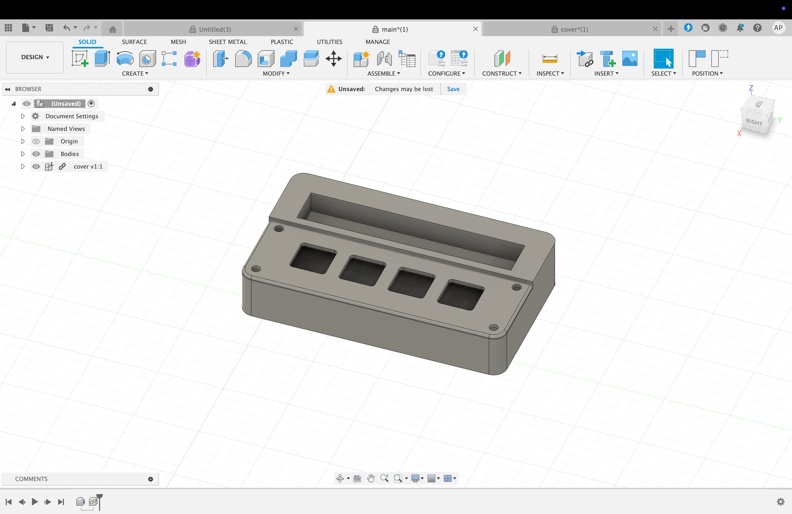
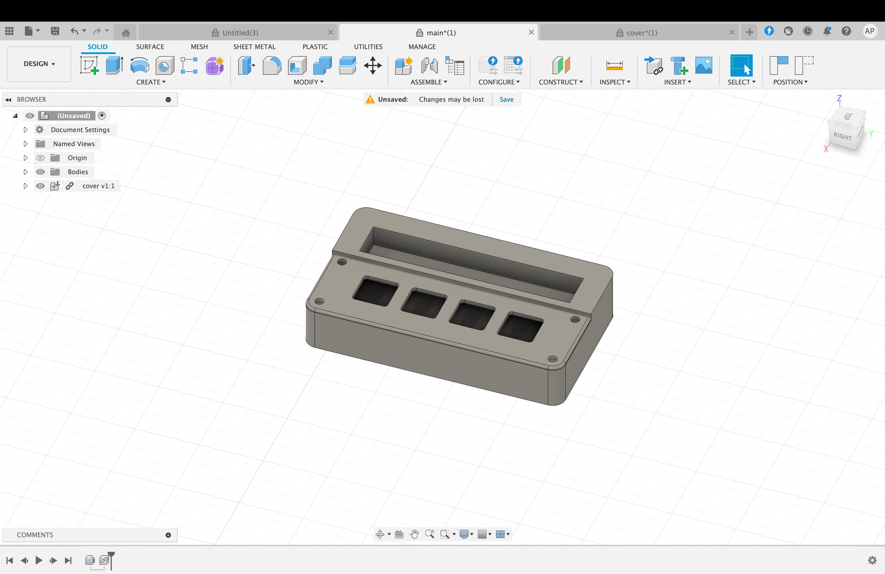
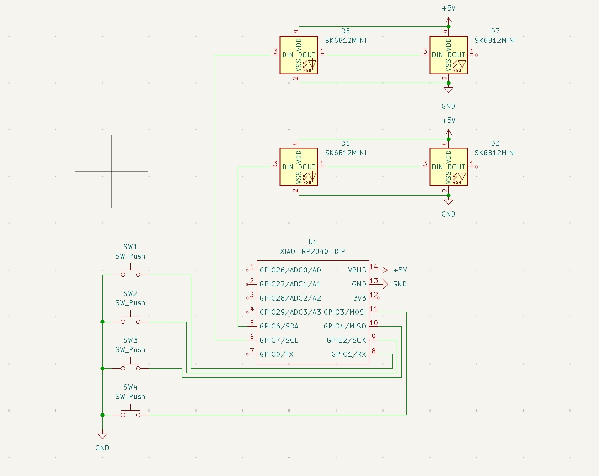

# Hackpad

This is just a little macropad with 4 buttons that I put together.

The 4 buttons do these things:
- Screenshot tool (takes selective screenshots)
- Developer combo (opens terminal + VS Code)
- Emoji picker (for quick reactions)
- Media control + focus mode toggle

**Bonus:** There's also a small storage compartment inside for SD cards, USB sticks, or other tiny accessories.

## How this thing came together
Made the 3D model in Fusion 360 and imported the PCB from KiCAD. The microcontroller is on the back so it looks cleaner from the front. Pretty happy with how it turned out.
 
| 1. Image   | 2. Image  |
|------------|-----------|
|  |  |
|  |  |

## The PCB
Designed in KiCAD, was a bit tedious but it works. Here are some screenshots:

| 1. Image   | 2. Image  |
|------------|-----------|
|  |  |

## BOM
1x XIAO RP2040 \
4x Cherry MX switches \
4x Heatset inserts (M3x5x4) \
4x screws (M3x16) \
3d printing Filament

## Make your own Hackpad!
Want to build one yourself? Check out this guide: https://hackpad.hackclub.com/guide
